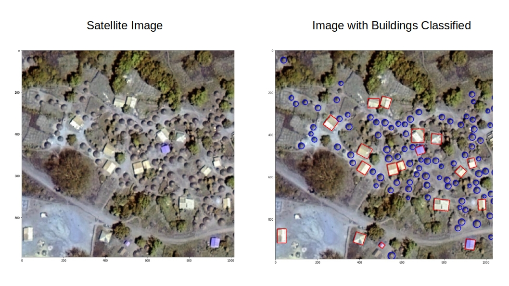

---
---

<link rel="stylesheet" href="styles.css" type="text/css">

## About me
My background is in mathematical biology. This background has grown
into experience using dynamical system models that solve applied problems in epidemiology,
an appreciation for the beauty in mathematics,
and a growing interest in machine learning. 
Currently, I use machine learning in R and Python to forecast the risk of animal-borne 
infectious diseases. Before that, I worked on models of animal
vaccination, with an emphasis on understanding the
benefits of transmissible vaccines. See below for details on current and recent projects. 

Click [here](files/CV/Basinski_CV.pdf) for a recent CV. 

***

         

\vspace{25in}

## Using machine vision to assess the risk of zoonotic diseases

 

 

Climatic and land cover GIS datasets are valuable for predicting the burden of disease risk in areas that lack proper health surveillance. However, GIS datasets are often too coarse to allow finescale assessment of disease risk within different areas of a single village. Finescale features such as housing quality likely affect zoonotic disease transmission to humans. For example, disease-carrying rodents are better able to gain entry into a thatch hut versus a modern concrete building. 

As part of ongoing work, we are designing a convolutional neural network (CNN) that will "see" local village features directly from aerial imagery. The CNN is constructed using the Keras and tensorflow libraries in python, and performs image segmentation to classify image pixels into discrete categories (i.e., building, rice cultivation, etc.). The CNN will allow local village features to be detected from aerial imagery across West Africa and summarized into statistics (housing density, land area of cultivation) that are meaningful predictors of local zoonotic disease transmission. The image above is a demonstration of our model's ability to detect buildings in a village.  

   

## Using machine learning to predict pathogenic threats

The 2020 Covid-19 pandemic is a salient reminder that approximately 40% of new human diseases stem from viruses or bacteria that circulate in wildlife populations. Covid-19 is believed to be transmitted by bats. Other examples are HIV from chimpanzees and Influenza A from birds. Many emerging human diseases originate in low and middle income regions of the world with limited health system infrastructure. Consequently, humanity is largely unaware of new emergent infectious diseases until after many humans are impacted (i.e., after a pandemic). 

As part of the DARPA-funded PREEMPT (PREventing the EMergence of Pathogenic Threats) project, I worked with a team of researchers at the University of Idaho to build a machine learning framework that predicts the risk of pathogen transmission from a wildlife reservoir into human populations. We applied our framework to Lassa virus, an RNA arenavirus that primarily circulates in rodent populations of West Africa and causes Lassa Fever when transmitted to humans. Rough estimates indicate that the Lassa virus infects around 100,000 - 300,000 per year, and as many as 13 million individuals per year. The true number is difficult to estimate because, while 2\% of cases are fatal, upwards of 80\% of all cases are asymptomatic. However, the high mutational ability of RNA viruses like Lassa allows the possibility of new, more dangerous strains emerging in human populations. The GIF below shows our model's predictions of Lassa transmission to humans in West Africa. 

{width=4in}

The forecasting model consists of different candidate submodels (layers) that each forecast a different aspect of the risk of Lassa Fever. The final forecasting model consists of a set of submodels that best predict the number of human Lassa cases in Nigeria. The first layer uses boosted regression trees that, when given land cover and weather attributes of known locations of Lassa occurence, predict the probability of Lassa being present at any 5 km by 5 km pixel across West Africa. Similarly, the second layer uses boosted regression trees to forecast the probability that the rodent reservoir of Lassa, the multimammate rat \emph{Mastomys natalensis}, occurs in a pixel. Finally, the third layer uses rodent trapping data to predict seasonal migrations of rats into and out of domestic settings.  The form of the forecast is

\[ \text{Lassa transmission risk} \sim D_L(x) D_R(x) T(t,x)\],

where $D_L(x)$ is the probability of Lassa occuring at spatial position x, $D_R(x)$ gives the probability that the primary rodent reservoir occurs, and $T(t,x)$ describes the seasonal migration of the reservoir. Here, dependence on the spatial coordinate $x$ occurs through weather and land cover predictors from satellite datasets. This work is submitted to the Proceedings of the Royal Society B, and available as a [BioRxiv preprint](https://www.biorxiv.org/content/10.1101/2020.03.05.979658v1). Code that is discussed in the manuscript is available in [this github repository](https://github.com/54481andrew/pathogen-spillover-forecast).

   

## Using machine vision to identify trees 

   

One of my favorite passtimes living in Wisconsin is plant identification -- the plant diversity in Wisconsin is amazing, so you never know what you'll find in some secluded meadow or woodland. This project is a fusion of my love of plant ID and my desire to learn more about machine vision with tensorflow.  The goal was to build a convolutional neural network (CNN) that could identify a tree's species from an image of its bark. This particular challenge was partly motivated by the oncoming fall weather -- tree ID is about to get a lot more difficult as the leaves fall -- and I would like to get better with winter tree ID.  

The project involved collecting an extensive image/species dataset of local trees (30+ hours in the woods) in some beautiful Wisconsin fall weather. The resulting [github repository](https://github.com/54481andrew/tree-bark-cnn) provides the full dataset that I collected, as well as a complete walkthrough of building, training, and evaluating the CNN. This project demonstrates certain key issues in machine learning, including data augmentation, how to handle imbalanced datasets in classification problems, and model selection. 

   

## When should you vaccinate a fluctuating population? 

   

Wildlife vaccination has proven itself an effective means of controlling diseases that can otherwise spread to humans and domestic pets (e.g. rabies in fox, coyotes, and raccoons). Given the success of vaccination campaigns in fox and raccoon populations, it is likely that vaccination will be used on other wildlife as well (e.g., Ebola in gorillas and/or bats, Lassa in rodents). From past campaigns on raccoons and fox, we know that vaccinating in the fall generally results in greater vaccine uptake, simply because the most recent juvenile population is developed and foraging at that time. My work with an undergraduate at the University of Idaho used a mathematical model to explore how timing of vaccination can influence the outcome of a disease management program in wildlife. Our work was published in the Journal of Applied Ecology (Schreiner, Basinski, 2020), and the associated code is available in [this github repository](https://github.com/54481andrew/Vaccinate-a-fluctuating-population).

