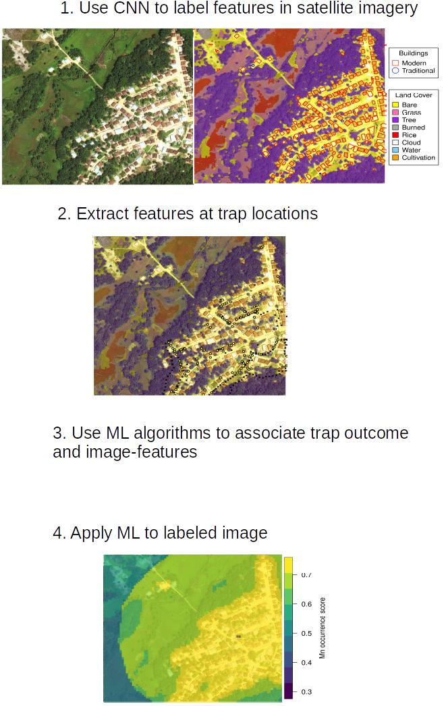

---
---

<link rel="stylesheet" href="styles.css" type="text/css">

## About me
My background is in mathematical biology. This background has grown into experience using dynamical system models that solve applied problems in epidemiology, an appreciation for the beauty in mathematics, and a passion for machine learning. Currently, I use machine learning in R and Python to forecast the risk of animal-borne infectious diseases. Before that, I worked on models of animal vaccination, with an emphasis on understanding the benefits of transmissible vaccines. See below for details on current and past projects. 

Click [here](files/CV/Basinski_CV.pdf) for a recent CV. 

***

         

## Forecasting the risk of pathogens with machine learning

The SARS-CoV-2 (i.e. Covid) pandemic is a salient reminder of the havoc that viral diseases can wreak on humanity. Like Covid, which probably originated in bats, approximately 40% of emerging human diseases stem from viruses or bacteria that circulate in wildlife populations.  Other examples are HIV from chimpanzees and Influenza A from birds. Because of their pandemic potential, it is important to monitor viruses that can transmit from wildlife into humans. However, many of these so-called zoonotic viruses originate in low and middle income regions of the world with limited health system infrastructure. Consequently, humanity is largely unaware of new emergent infectious diseases until after many humans are impacted (i.e., after a pandemic). 

As part of the DARPA-funded project called PREEMPT (PREventing the EMergence of Pathogenic Threats), I work with a team of researchers at the University of Idaho to develop machine learning pipelines that predict the risk of pathogen transmission from a wildlife reservoir into human populations. Our group's focus is Lassa virus, an RNA arenavirus that primarily circulates in rodent populations of West Africa and causes Lassa Fever when transmitted to humans. Symptoms of Lassa Fever vary widely, ranging from flu-like symptoms in mild cases to hearing-loss, hemorrhage, and death in severe cases. Current estimates suggest about 80\% of all cases are asymptomatic and 2\% of cases are fatal. Even more worrying is the potential for Lassa virus to mutate in ways that boost its transmission or virulence to humans. 

Because of the lack of health infrastructure in West Africa, many cases of Lassa Fever go unreported. As a result, the true spatial extent of Lassa Fever is unknown. Our machine-learning models of Lassa allow us to predict the geographical region in which rodent-to-human Lassa virus transmission occurs. The GIF below shows our model's predictions of Lassa transmission to humans in West Africa. 

{width=4in}

The forecasting model consists of multiple submodels (layers) that each forecast a different aspect of the risk of Lassa Fever. The first layer uses boosted regression trees that, when given land cover and climate attributes of known locations of Lassa occurrence, predict the probability of Lassa being present in the rodent population within each 5 km by 5 km pixel across West Africa. Similarly, the second layer uses boosted regression trees to forecast the probability that the rodent reservoir of Lassa, the multimammate rat \emph{Mastomys natalensis}, occurs in a pixel. Finally, a third layer uses rodent trapping data to predict seasonal migrations of rats into and out of domestic settings.  The form of the forecast is

\[ \text{Lassa transmission risk} \sim D_L(x) D_R(x) T(t,x),\]
where $D_L(x)$ is the probability of Lassa occurring at spatial position x, $D_R(x)$ gives the probability that the primary rodent reservoir occurs, and $T(t,x)$ describes the seasonal migration of the reservoir. Here, dependence on the spatial coordinate $x$ occurs through climate and land cover predictors from satellite datasets. This work is ongoing; a version of this framework has been published in PLOS Computational Biology, and is available [here](https://journals.plos.org/ploscompbiol/article?id=10.1371/journal.pcbi.1008811). Code that is discussed in the manuscript is available in [this Github repository](https://github.com/54481andrew/pathogen-spillover-forecast).

   

\vspace{25in}

## Using machine vision to "see" fine-scale risk

Climatic and land cover GIS datasets are valuable for predicting the burden of disease risk in broad geographical areas. However, GIS datasets are often too coarse to allow fine-scale assessment of disease risk at, for example, the level of an individual village. This is unfortunate because fine-scale features such as housing style likely affect the extent to which humans interact with wildlife reservoirs like rodents --and as a consequence -- the extent to which wildlife-borne diseases are transmitted to humans. For example, disease-carrying rodents are better able to gain entry into a building that is constructed with thatch and mud  compared to a modern concrete building.

As part of ongoing work, I am designing a convolutional neural network (CNN) that will "see" local village features directly from satellite imagery. The village features, in turn, will be used by downstream models to predict risk of rodent-to-human transmission of Lassa. The CNN that underlies this pipeline is constructed using the Keras and tensorflow libraries in python and performs image segmentation to classify image pixels into discrete categories (i.e., building, rice cultivation, etc.). The CNN will allow local village features to be detected from satellite imagery across West Africa and summarized into statistics (housing density, land area of cultivation) that are meaningful predictors of local zoonotic disease transmission. The image above is a demonstration of our model's ability to detect different types of buildings and land features in an image.  Want to know more? Check out my [machine vision Github repository](https://github.com/54481andrew/sky-glass) that walks through the process of training a CNN to detect features in satellite imagery. The current status of this work is depicted below:

 

 

   

## Developing mathematical models that help strategize intervention of wildlife pathogens

 

Wildlife vaccination has proven itself an effective means of controlling diseases that can otherwise spread to humans and domestic pets (e.g. rabies in fox, coyotes, and raccoons). Given the success of vaccination campaigns in fox and raccoon populations, it is likely that vaccination will be used on other wildlife as well (e.g., Ebola in gorillas and/or bats, Lassa in rodents). From past campaigns on raccoons and fox, we know that vaccinating in the fall generally results in greater vaccine uptake, simply because the most recent juvenile population is developed and foraging at that time. However, the importance of timing in vaccination campaigns has never been investigated for other wildlife reservoirs of pathogens. To address this knowledge, I worked with an undergraduate at the University of Idaho to build a mathematical model and explore how timing of vaccination can influence the outcome of a disease management program for wildlife. Our work was published in the Journal of Applied Ecology ([Schreiner, Basinski, 2020](https://besjournals.onlinelibrary.wiley.com/doi/abs/10.1111/1365-2664.13539)), and the associated code is available in [this Github repository](https://github.com/54481andrew/Vaccinate-a-fluctuating-population).

  

## Hobby-project: Using machine vision to identify trees 

 

When I'm not researching, one of my favorite pastimes is plant identification -- the plant diversity in Wisconsin is amazing, so you never know what you'll find in some secluded meadow or woodland. This project is a fusion of my love of plant ID and my desire to learn more about machine vision with tensorflow.  The goal was to build a convolutional neural network (CNN) that could identify a tree's species from an image of its bark. This particular challenge was partly motivated by the oncoming fall weather -- tree ID is about to get a lot more difficult as the leaves fall -- and I would like to get better with winter tree ID.  

The project involved collecting an extensive image/species dataset of local trees (30+ hours in the woods) in some beautiful Wisconsin fall weather. The resulting [Github repository](https://github.com/54481andrew/tree-bark-cnn) provides the full dataset that I collected, as well as a complete walk through of building, training, and evaluating the CNN. This project demonstrates certain key issues in machine learning, including data augmentation, how to handle imbalanced datasets in classification problems, and model selection. 

   

## Hobby-project: Shiny App that forecasts stock prices

Using R packages like Shiny, forecast, and ggplot, I've put together a small app that downloads, plots, and forecasts stock prices. The code is contained in [this Github repository](https://github.com/54481andrew/stock-forecast). Admittedly, the application is very simple. A user can enter a stock symbol (e.g., VOO, TSLA, etc) and click "Update Plot" to download and plot the corresponding monthly-averaged stock prices. If the "Overlay Forecast" option is checked, updating the plot will add in a forecast fit using the Exponential Triple Smoothing algorithm (ETS). The forecasted values that are plotted range from one month forward of the current month, to the end date selected by the user in the date range input. 80% and 95% prediction intervals are added to the forecasted values, plotted in pink and red, respectively.    

<iframe src ="https://54481andrew.shinyapps.io/stock-forecast-master/?_ga=2.210613591.375051434.1628385409-2013378022.1628214290"
  style="border: none; width: 100%; height: 500px;"/>
</iframe>

   
