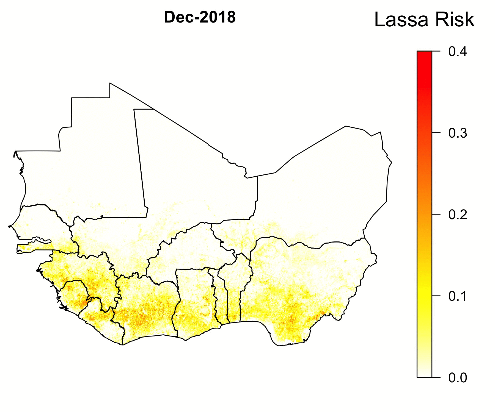

---
---

<link rel="stylesheet" href="styles.css" type="text/css">

My background is in mathematical biology. This background has grown
into experience using dynamical system models that solve applied problems in epidemiology,
an appreciation for the beauty in mathematics,
and a growing interest in machine learning. 
Currently, I use machine learning in R and Python to forecast the risk of animal-borne 
infectious diseases. Before that, I worked on models of animal
vaccination, with an emphasis on understanding the
benefits of transmissible vaccines. See below for details on current and recent projects. 

Click [here](files/CV/Basinski_CV.pdf) for a recent CV. 

***

         

\vspace{25in}

##Lassa Risk Map   

Approximately 40% of new human diseases stem from viruses or bacteria that circulate in wildlife populations. Examples are HIV from chimpanzees, Influenza A from birds, and SARS from bats. In addition, many emerging human diseases originate in low and middle income regions of the world with limited health infrastructure. Consequently, humanity is largely unaware of new emergent infectious diseases until after many humans are impacted (i.e., after a pandemic). In this work, we develop a machine learning framework that is capable of using limited disease data to predict the relative disease risk of a wildlife reservoir to humans.  

We applied our framework to Lassa virus, an RNA arenavirus that primarily circulates in rodent populations of West Africa and causes Lassa Fever when transmitted to humans. Rough estimates indicate that the Lassa virus infects as many as 500000 individuals per year. Though many cases of Lassa Fever are asymptomatic, about 5000 individuals die each year from the disease. Even more worrisome, chance mutations could allow the Lassa virus to better circulate in humans or increase the deadliness of the virus.  

The GIF below shows model predictions for recent (as of this writing) months in West Africa. As you can see, the risk of Lassa transmission is predicted to be greatest in December and January, and varies spatially as well. This is important information that will help guide Lassa intervention strategies and subsequent research to regions where the need is greatest.

{width=4in}

The forecasting model consists of different candidate submodels (layers) that each forecast a different aspect of the risk of Lassa Fever. The final forecasting model consists of a set of submodels that best predict the number of human Lassa cases in Nigeria. The first layer uses boosted regression trees that, when given land cover and weather attributes of known locations of Lassa occurence, predict the probability of Lassa being present at any 5 km by 5 km pixel across West Africa. Similarly, the second layer uses boosted regression trees to forecast the probability that the rodent reservoir of Lassa, the multimammate rat \emph{Mastomys natalensis}, occurs in a pixel. Finally, the third layer uses rodent trapping data to predict seasonal migrations of rats into and out of domestic settings.  The form of the forecast is

\[ \text{Lassa transmission risk} \sim D_L(x) D_R(x) T(t,x)\],

where $D_L(x)$ is the probability of Lassa occuring at spatial position x, $D_R(x)$ gives the probability that the primary rodent reservoir occurs, and $T(t,x)$ describes the seasonal migration of the reservoir. Here, dependence on the spatial coordinate $x$ occurs through weather and land cover predictors from satellite datasets. This work is in the process of being published. 

   

##When should you vaccinate a fluctuating population? 

   

Wildlife vaccination has proven itself an effective means of controlling diseases that can otherwise spread to humans and domestic pets (e.g. rabies in fox, coyotes, and raccoons). Given the success of vaccination campaigns in fox and raccoon populations, it is likely that vaccination will be used on other wildlife as well (e.g., Ebola in gorillas and/or bats, Lassa in rodents). From past campaigns on raccoons and fox, we know that vaccinating in the fall generally results in greater vaccine uptake, simply because the most recent juvenile population is developed and foraging at that time. My work with an undergraduate at the University of Idaho used a mathematical model to explore how timing of vaccination can influence the outcome of a disease management program in wildlife. Our work was published in the Journal of Applied Ecology (Schreiner, Basinski, 2020), and the associated code is available in <a href = "https://github.com/54481andrew/Vaccinate-a-fluctuating-population"> this github repository

