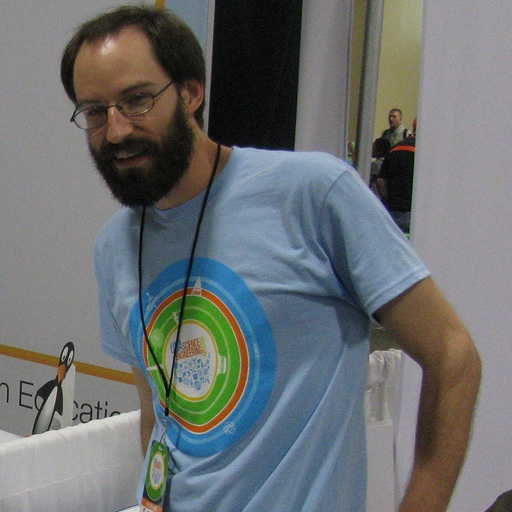

---
---

<link rel="stylesheet" href="styles.css" type="text/css">

My work is centered on building forecasting models of animal-borne infectious disease. As a postdoc in [Scott Nuismer's lab] (https://www.leeef.org/team),I've developed a forecasting model of Lassa fever.  

I graduated from the [University of Utah] (www.math.utah.edu) with a PhD in mathematics in 2016. 

My full CV is available [here](files/Zabor_CV_2017_Q4.pdf).